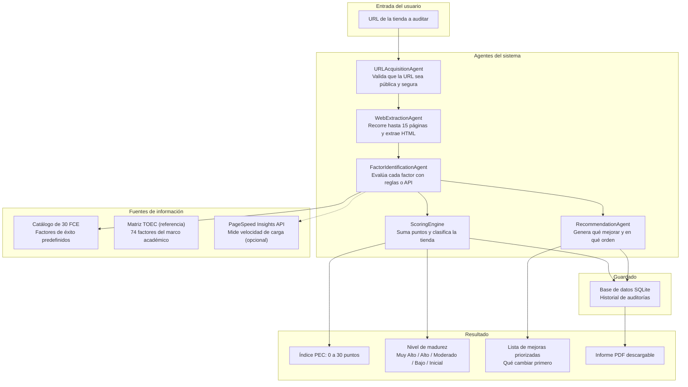
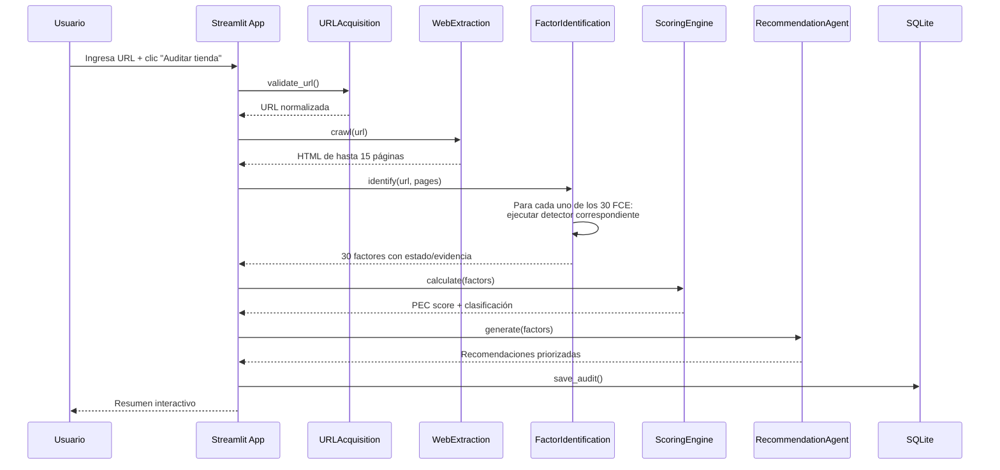
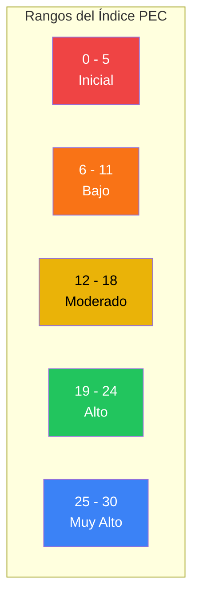
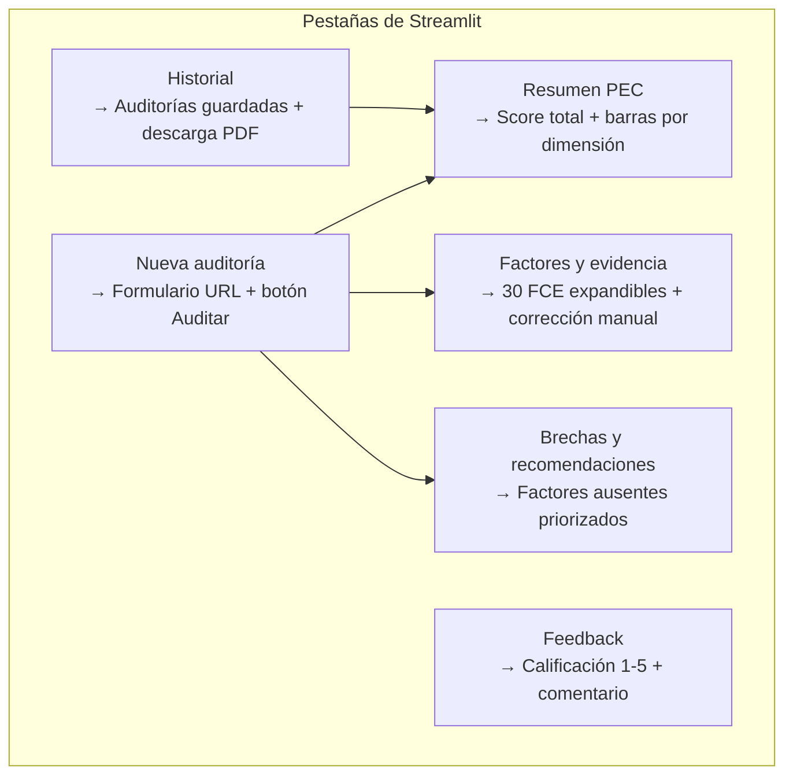

# PEC Auditor

Demo académica en Streamlit para diagnosticar **30 factores críticos de éxito (FCE)** públicamente observables en tiendas e-commerce de Lima Metropolitana.

---

## Arquitectura del Sistema



---

## Flujo de Ejecución



---

## Los 30 Factores Críticos de Éxito (FCE)

### Dimensión Tecnológica (10 factores)

| ID | Factor | Detector |
|----|--------|----------|
| T01 | HTTPS/SSL | Verificación de esquema |
| T02 | Diseño móvil | Meta viewport |
| T03 | Rendimiento de carga | PageSpeed Insights API |
| T04 | Navegación principal | Regex: `<nav>`, menú, categorías |
| T05 | Buscador interno | Regex: tipo search, búsqueda |
| T06 | Catálogo accesible | Regex: catálogo, productos |
| T07 | Ficha de producto | Regex: descripción, agregar al carrito |
| T08 | Precio y disponibilidad | Regex: S/, US$, stock |
| T09 | Carrito/checkout | Regex: carrito, checkout |
| T10 | Métodos de pago | Regex: visa, yape, plin, paypal |

### Dimensión Organizacional y Proceso (10 factores)

| ID | Factor | Detector |
|----|--------|----------|
| O01 | Política de privacidad | Regex |
| O02 | Aviso de cookies | Regex |
| O03 | Términos y condiciones | Regex |
| O04 | Política de envío | Regex |
| O05 | Costo/plazo de entrega | Regex |
| O06 | Devoluciones y cambios | Regex |
| O07 | Preguntas frecuentes | Regex |
| O08 | Canales de contacto | Regex |
| O09 | Soporte o chat | Regex: WhatsApp, chat |
| O10 | Identificación legal | Regex: RUC, razón social |

### Dimensión Ambiental Visible (4 factores)

| ID | Factor | Detector |
|----|--------|----------|
| A01 | Cobertura de entrega | Regex |
| A02 | Redes sociales | Regex: Instagram, Facebook |
| A03 | Promociones | Regex: oferta, descuento |
| A04 | Marketplaces externos | Regex |

### Dimensión Consumidor (6 factores)

| ID | Factor | Detector |
|----|--------|----------|
| C01 | Reseñas/testimonios | Regex |
| C02 | Sellos de confianza | Regex |
| C03 | Página Nosotros | Regex |
| C04 | Garantías visibles | Regex |
| C05 | Favoritos/personalización | Regex |
| C06 | Accesibilidad básica | HTML: lang, main, alt images |

---

## Clasificación PEC



---

## Interfaz de Usuario



---

## Flujo de Auditoría Interactivo

Al hacer clic en **Auditar tienda**, el sistema muestra cada paso en tiempo real:

```
┌─────────────────────────────────────────────────┐
│ Auditoría en progreso...                          │
│                                                   │
│ ✓ Validando URL y resolviendo dominio...          │
│   URL normalizada: `https://www.ripley.com.pe`   │
│                                                   │
│ ✓ Explorando hasta 15 páginas públicas...         │
│   Se exploraron 5 páginas públicas.              │
│                                                   │
│ ✓ Detectando evidencia de los 30 FCE...           │
│   12 presentes, 3 parciales, 14 ausentes, 1 N/E  │
│                                                   │
│ ✓ Calculando Índice PEC...                        │
│   PEC: 15/30 — Nivel: Moderado                   │
│                                                   │
│ ✓ Generando recomendaciones prioritarias...       │
│                                                   │
│ ✓ Guardando auditoría en la base de datos...      │
│   Auditoría guardada con ID #5.                  │
│                                                   │
│ ┌──────────────────────────────────────────────┐ │
│ │ Auditoría completada                          │ │
│ └──────────────────────────────────────────────┘ │
└─────────────────────────────────────────────────┘

┌─────────────────────────────────────────────────┐
│ Resumen de la auditoría                          │
│                                                   │
│  Índice PEC    Nivel        Páginas   Factores   │
│   15/30       Moderado        5         30       │
│                                                   │
│  Presentes   Parciales   Ausentes   No Eval.     │
│      12          3           14         1        │
└─────────────────────────────────────────────────┘
```

---

## Instalación y Ejecución

Requiere Python 3.10 o superior.

```powershell
python -m venv .venv
.\.venv\Scripts\Activate.ps1
python -m pip install -r requirements.txt
streamlit run app.py
```

Después abra `http://localhost:8501`.

### Variables de entorno (opcional)

Copie `.env.example` como `.env`:

| Variable | Descripción | Default |
|----------|-------------|---------|
| `PAGESPEED_API_KEY` | API key de Google PageSpeed Insights | (vacío) |
| `AUDIT_MAX_PAGES` | Máximo de páginas a rastrear | 15 |
| `AUDIT_TIMEOUT_SECONDS` | Timeout por página | 20 |
| `DATABASE_PATH` | Ruta a la base SQLite | `data/pec_auditor.db` |

---

## Pruebas

```powershell
python -m unittest discover -s tests -v
```

---

## Estructura del Proyecto

```
ml-eccomerce/
├── app.py                          # Interfaz principal (Streamlit)
├── factor_catalog.json             # 30 FCE operativos
├── toec_matrix.json                # 74 FCE de referencia (TOEC)
├── requirements.txt                # Dependencias
├── .env.example                    # Plantilla de variables
│
├── agents/                         # Agentes del sistema multi-agente
│   ├── url_acquisition.py          # Validación y normalización de URLs
│   ├── web_extraction.py           # Crawler BFS de páginas públicas
│   ├── factor_identification.py    # Detección de 30 FCE
│   ├── scoring_engine.py           # Cálculo del Índice PEC
│   ├── gap_prioritization.py       # Priorización de brechas
│   └── recommendations.py          # Generación de recomendaciones
│
├── modules/                        # Módulos complementarios
│   └── feedback.py                 # Sistema de feedback JSON
│
├── utils/                          # Utilidades
│   ├── storage.py                  # Persistencia SQLite
│   └── reporting.py                # Generación de PDF
│
├── tests/                          # Pruebas unitarias
│   ├── test_storage.py
│   ├── test_scoring.py
│   ├── test_url_acquisition.py
│   └── test_catalog_and_extraction.py
│
├── data/                           # Datos generados
│   ├── pec_auditor.db              # Base de datos SQLite
│   └── feedback.json               # Feedback guardado
│
└── docs/                           # Documentación académica
    ├── *.docx                      # Documento de tesis
    └── *.pdf                       # Papers de referencia
```
